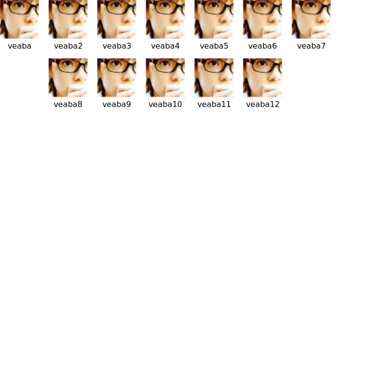
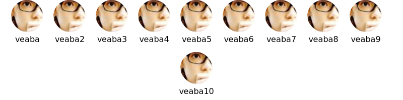
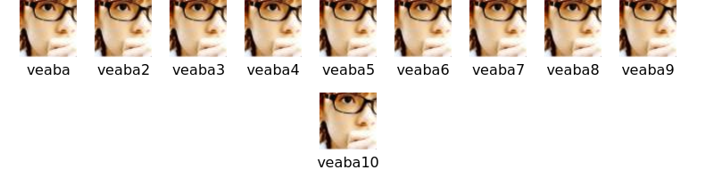

##  How use

1. pull request your repo 
2. we merge your PR
3. the repo will be generate some svg data
4. add svg path to your repo's:
  - format: `https://githubxx.com/veaba/contributors/repos/{owner}/{repo}.svg`
  - try it: ``

```markdown


```

## Design 

- [x] Automatic clipping and rounding of Avatar
- [x] Horizontal Auto Center
  

### size

### category(TODO)

```diff
export default {
+  'veaba/veaba': {
+    category: [
+     {
+        label: 'Platinum Sponsors',
+        users: ['veaba']
+     },
+     {
+        label: 'Gold Sponsors',
+        users: ['veaba2']
+     },
+     {
+        label: 'Silver Sponsors',
+        users: ['veaba3']
+     },
+     {
+        label: 'Sponsors',
+        users: ['veaba4']
+     }
+  ]
  }
}
```


### circle

- `circle`: default: circle 



- `isRadius:false`: you can disabled the feature

```diff 
export default {
+  'vuejs-translations/docs-zh-cn': {
+    isRadius: false,
+  }
}
```


### margin

### text display

- [] configure text color? （It't necessary?）

### config 

maybe you need filter some users.

emm, just like as `vuejs-translations/docs-zh-cn`, it's a Chinese translation for Vue docs community, we does't need show non Chinese contributors in our repo, actually, `vuejs-translations/docs-zh-cn` upstream repo is `vuejs/docs`.

in `config.ts` add your repo configure.

```diff
export default {
+  'veaba/veaba': {
+    ignore: [] // if you need ignore some users
+  }
}
```

## Examples


### demovuejs-translations/docs-zh-cn contributors

in `config.js`:

```diff 
+ const config: ConfigItem =
+ {
+   // https://github.com/vuejs-translations/docs-zh-cn
+   'vuejs-translations/docs-zh-cn': {
+     ignore: [
+       'yyx990803', 'NataliaTepluhina', 'skirtles-code', 'bencodezen', 'dependabot[bot]',
+       'LinusBorg', 'KiritaniAyaka', 'Alex-Sokolov', 'sdras', 'marina-mosti', 'CyberAP',
+       'danielkellyio', 'tylermercer',
+     ], // if you need ignore some users
+     // users: [],?? maybe we need this field.
+     ignoreTotal: 1, // filter some users whose total is too low
+     size: 100,
+     height: 2500, // TODO: maybe automatic
+     width: 800,
+     fontSize: 30,
+   }
+ }
export default config
```


## TODO

- The picture is not completely loaded
