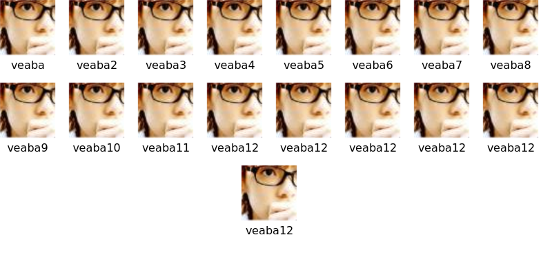

## Metrics

```js
200	
- w - Start of the week, given as a Unix timestamp.
- a - Number of additions
- d - Number of deletions
- c - Number of commits
```

##  how use 

1. pull request your repo 
2. we merge your PR
3. the repo will be generate some svg data
4. add svg path to your repo's:
  - format: `https://githubxx.com/veaba/contributors/repos/{owner}/{repo}.svg`
  - try it: ``

```markdown


```

## Design 

- [] 自动裁剪圆角
- [x] 左右自动居中特性
  - 如果当前行没有溢出，则会被居中

  

### size

### category

```diff
export default {
+  'veaba/veaba': {
+    category: [
+     {
+        label: 'Platinum Sponsors',
+        users: ['veaba']
+     },
+     {
+        label: 'Gold Sponsors',
+        users: ['veaba2']
+     },
+     {
+        label: 'Silver Sponsors',
+        users: ['veaba3']
+     },
+     {
+        label: 'Sponsors',
+        users: ['veaba4']
+     }
+  ]
  }
}
```


### circle

### margin

### text display

- [] configure text color? （I'm not sure if I need this feature..）

### config 

maybe you need filter some users.

emm, just like as `vuejs-translations/docs-zh-cn`, it's a Chinese translation for Vue docs community, we does't need show non Chinese contributors in our repo, actually, `vuejs-translations/docs-zh-cn` upstream repo is `vuejs/docs`.


```diff
export default {
+  'veaba/veaba': {
+    ignore: [] // if you need ignore some users
+  }
}
```